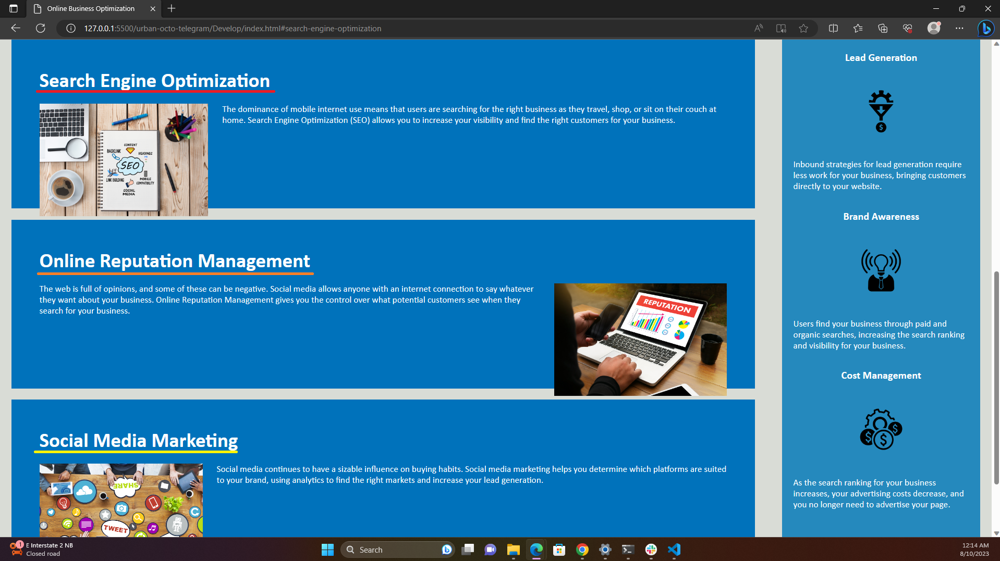

# <Horiseon>

## Description

The goal of this project was to organize the codebase and fully optimize it for search engines by following accessibility standards. 

## Installation

N/A

## Usage

Users are easily able to navigate the site by using the buttons found at the top right corner underlined in red, orange, and yellow, as seen below.

Users will automatically be directed to the corresponding blurbs, as seen below.

## Credits

N/A

## License

Please refer to the LICENSE in the repo.
